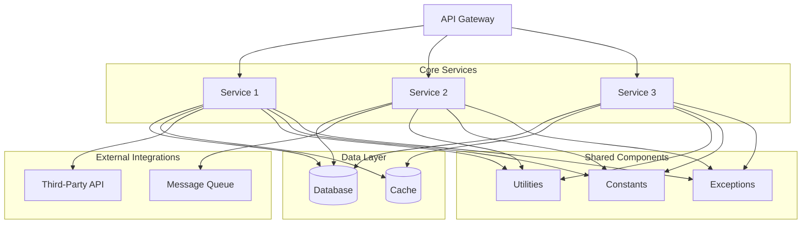
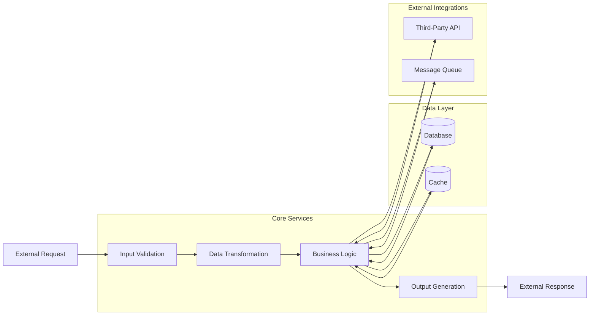

# Software Architecture for a SPARC Framework Project

The SPARC (Scalable, Portable, Adaptable, Resilient, and Cloud-based) framework is a set of principles and guidelines for designing and building software systems that are scalable, portable, adaptable, resilient, and cloud-based. In this document, we will outline the software architecture for a project following the SPARC framework principles.

## System Components

The system consists of the following main components:

1. **Core Services**: These are the primary services that provide the core functionality of the application. They are responsible for handling business logic, processing data, and exposing APIs for external consumption.

2. **Data Layer**: This component manages the storage and retrieval of data. It includes databases, caching mechanisms, and data access layers.

3. **External Integrations**: These components handle communication with external systems, such as third-party APIs, messaging queues, or other services.

## Component Interactions

### Service Communication

The core services communicate with each other through well-defined APIs. These APIs are designed to be RESTful and follow industry-standard practices for API design. Communication between services can be synchronous (HTTP requests) or asynchronous (message queues).

### Data Flow

The data flow within the system follows a specific pattern:

1. **Input Processing**: External requests (e.g., API calls, user interactions) are received and validated by the core services.

2. **Data Transformation**: The core services process the input data, perform business logic, and transform the data as needed.

3. **Storage**: The transformed data is persisted in the data layer (databases, caches) for future use or retrieval.

4. **Retrieval**: When data is needed, the core services retrieve it from the data layer and perform any necessary transformations or processing.

5. **Output**: The processed data is returned to the client or external system in the expected format (e.g., JSON, XML).

### API Contracts

All communication between components (both internal and external) is governed by well-defined API contracts. These contracts specify the request and response formats, data structures, and expected behavior. API contracts are versioned and documented to ensure compatibility and ease of maintenance.

## Key Design Decisions

### Technology Choices

The following technologies have been chosen for this project:

- **Programming Language**: The project is built using [language choice], which is a modern, high-performance language that supports both object-oriented and functional programming paradigms.

- **Web Framework**: The core services are built using [web framework], which is a popular and robust web framework for [language choice]. It provides features like routing, middleware, and dependency injection out of the box.

- **Database**: The data layer uses [database choice], which is a scalable and highly available database management system. It supports various data models (e.g., relational, document-oriented) and provides features like sharding and replication for improved performance and resilience.

- **Caching**: The system utilizes [caching solution] for caching frequently accessed data. This improves performance and reduces the load on the database.

- **Message Queue**: For asynchronous communication between services, the system uses [message queue solution], which is a reliable and scalable message queuing system.

- **API Gateway**: An API gateway, such as [API gateway solution], is used to provide a single entry point for external clients, handle authentication and authorization, and route requests to the appropriate core services.

### Architectural Patterns

The system follows the following architectural patterns:

- **Microservices Architecture**: The core services are designed as independent, loosely coupled microservices. Each microservice is responsible for a specific business capability and can be developed, deployed, and scaled independently.

- **Event-Driven Architecture**: Some components of the system communicate through events, using a message queue or an event bus. This decouples the components and allows for more flexible and scalable communication.

- **Hexagonal Architecture (Ports and Adapters)**: The core services are structured using the Hexagonal Architecture pattern, which separates the business logic from the external dependencies (e.g., databases, external APIs). This promotes testability, maintainability, and flexibility in swapping out external dependencies.

### Security Measures

The following security measures are implemented in the system:

- **Authentication and Authorization**: The system implements industry-standard authentication and authorization mechanisms, such as OAuth 2.0 or JSON Web Tokens (JWT), to secure access to APIs and resources.

- **Input Validation**: All user input and external data is validated and sanitized to prevent vulnerabilities like SQL injection, cross-site scripting (XSS), and other types of attacks.

- **Encryption**: Sensitive data is encrypted both in transit (using HTTPS) and at rest (using encryption algorithms like AES-256).

- **Audit Logging**: The system logs all security-related events, such as authentication attempts, authorization failures, and other suspicious activities, for auditing and monitoring purposes.

- **Secure Communication**: Communication between components and external systems is secured using industry-standard protocols like TLS/SSL.

- **Secure Deployment**: The system is deployed in a secure environment, with appropriate network segmentation, firewall rules, and other security best practices.

## File and Folder Structure

The project follows a modular structure, with each component or feature organized into its own folder or module. Here's a high-level overview of the file and folder structure:

```
project-root/
├── src/
│   ├── core-services/
│   │   ├── service1/
│   │   │   ├── controllers/
│   │   │   ├── services/
│   │   │   ├── repositories/
│   │   │   ├── models/
│   │   │   └── routes/
│   │   ├── service2/
│   │   │   ├── ...
│   │   └── ...
│   ├── data-layer/
│   │   ├── database/
│   │   ├── cache/
│   │   └── data-access/
│   ├── external-integrations/
│   │   ├── third-party-api/
│   │   ├── message-queue/
│   │   └── ...
│   ├── shared/
│   │   ├── utils/
│   │   ├── constants/
│   │   ├── exceptions/
│   │   └── ...
│   ├── config/
│   ├── tests/
│   └── app.js
├── docker/
├── kubernetes/
├── .env
├── package.json
└── ...
```

- `src/core-services/`: This folder contains the individual core services, each in its own subfolder. Each service follows a modular structure, with separate folders for controllers, services, repositories, models, and routes.

- `src/data-layer/`: This folder contains components related to data storage and retrieval, such as the database, caching mechanisms, and data access layers.

- `src/external-integrations/`: This folder contains components that handle communication with external systems, such as third-party APIs, message queues, or other services.

- `src/shared/`: This folder contains shared utilities, constants, exceptions, and other reusable code that can be used across multiple components.

- `src/config/`: This folder contains configuration files for the application, such as database connection strings, API keys, and other environment-specific settings.

- `src/tests/`: This folder contains unit tests, integration tests, and other test suites for the application.

- `docker/`: This folder contains Dockerfiles and related files for building and deploying the application as Docker containers.

- `kubernetes/`: This folder contains Kubernetes manifests and configuration files for deploying the application on a Kubernetes cluster.

- `.env`: This file contains environment variables used by the application.

- `package.json`: This file contains metadata and dependencies for the project, as well as scripts for building, testing, and running the application.

## Detailed Diagrams

### System Architecture Diagram



This diagram illustrates the high-level architecture of the system, showing the core services, data layer, external integrations, shared components, and the API gateway. It depicts the interactions and data flow between the different components.

### Data Flow Diagram



This diagram illustrates the data flow within the system, showing the different stages of data processing, from input validation to output generation. It also depicts the interactions with the data layer and external integrations during the data processing stages.

## Conclusion

The proposed software architecture follows the SPARC framework principles, ensuring that the system is scalable, portable, adaptable, resilient, and cloud-based. It leverages modern technologies and architectural patterns to achieve these goals, while also emphasizing security and maintainability. The modular structure, well-defined component interactions, and clear data flow make the system easy to understand, develop, and maintain. The detailed diagrams provide a visual representation of the system architecture and data flow, aiding in communication and documentation.