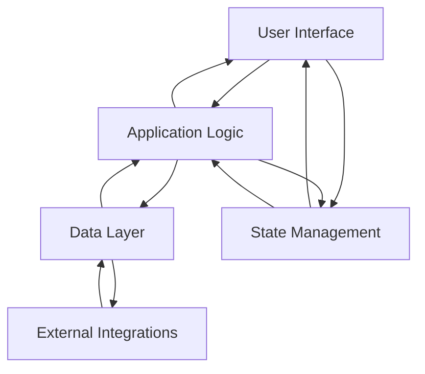
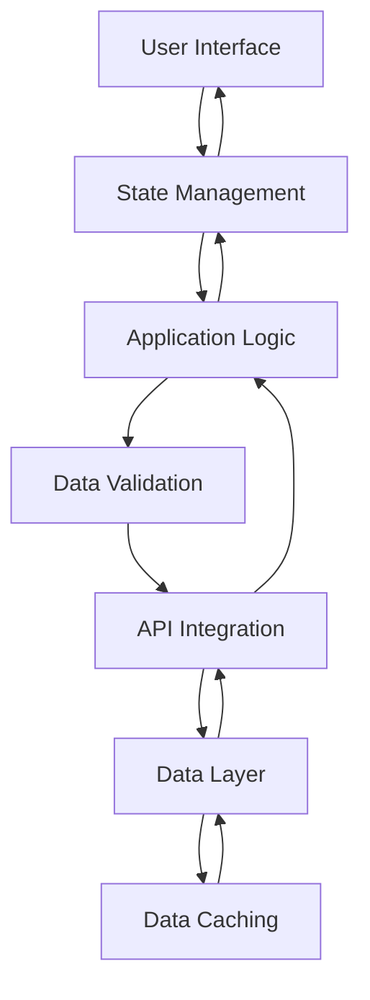

# Software Architecture for a Full ViteJS Application with Sticky Top Nav, Sidebar, Mobile, View and Agent Management System

## System Components

1. **User Interface (UI) Layer**
   - **Sticky Top Navigation**: A persistent top navigation bar that remains visible while scrolling.
   - **Sidebar**: A collapsible sidebar for navigation and additional functionalities.
   - **Mobile Responsive UI**: Responsive design to ensure optimal user experience across different devices and screen sizes.
   - **View Management**: Components for displaying and managing various views or sections of the application.
   - **Agent Management**: Components for managing agents, including CRUD operations and related functionalities.

2. **Application Logic Layer**
   - **State Management**: A centralized state management solution (e.g., Vuex, Pinia) for managing the application state and data flow.
   - **API Integration**: Services for integrating with external APIs and handling API requests and responses.
   - **Authentication and Authorization**: Modules for user authentication, authorization, and access control.
   - **Routing and Navigation**: Routing mechanisms for handling client-side navigation and URL management.
   - **Utilities and Helpers**: Reusable utility functions and helper modules for common tasks.

3. **Data Layer**
   - **Data Access Layer**: Abstraction layer for interacting with the data store (e.g., RESTful API, GraphQL API).
   - **Data Caching**: Mechanisms for caching data to improve performance and reduce server load.
   - **Data Validation**: Modules for validating user input and ensuring data integrity.

4. **External Integrations**
   - **Third-Party APIs**: Integration with external APIs for additional functionalities (e.g., authentication, notifications, analytics).
   - **Backend Services**: Integration with backend services for server-side data processing and storage.

## Component Interactions

1. **User Interface Components**
   - The UI components interact with the state management system to retrieve and update the application state.
   - UI components communicate with the application logic layer to perform various actions, such as API calls, data manipulation, and routing.
   - UI components can also interact directly with external integrations for specific functionalities (e.g., authentication, notifications).

2. **Application Logic Layer**
   - The state management system acts as a central hub for managing the application state and data flow.
   - API integration services handle communication with external APIs and data sources.
   - Authentication and authorization modules manage user authentication, authorization, and access control.
   - Routing and navigation modules handle client-side navigation and URL management.
   - Utilities and helpers are used across the application for common tasks and functionality.

3. **Data Layer**
   - The data access layer provides an abstraction for interacting with the data store, handling data retrieval, and persistence.
   - Data caching mechanisms improve performance by reducing redundant data fetches and server load.
   - Data validation modules ensure data integrity by validating user input and enforcing data constraints.

4. **External Integrations**
   - Third-party APIs and backend services are integrated to provide additional functionalities or data sources.
   - External integrations can be consumed by various components and services within the application logic layer.

## Data Flow

1. **User Input Processing**
   - User interactions (e.g., form submissions, button clicks) are captured by the UI components.
   - UI components dispatch actions to the state management system or invoke application logic layer services.

2. **Data Transformation**
   - Application logic layer services handle data transformation and manipulation as needed.
   - Data validation modules ensure data integrity before further processing.

3. **API Communication**
   - API integration services handle communication with external APIs and data sources.
   - Data access layer abstracts the interaction with the data store, handling data retrieval and persistence.

4. **State Management**
   - The state management system manages the application state and data flow.
   - UI components subscribe to relevant state changes and update the user interface accordingly.

5. **Data Caching**
   - Data caching mechanisms store frequently accessed data in memory or local storage for faster retrieval.
   - Cached data is used to reduce redundant data fetches and improve performance.

6. **External Integrations**
   - Third-party APIs and backend services are integrated to provide additional functionalities or data sources.
   - External integrations can be consumed by various components and services within the application logic layer.

## Key Design Decisions

1. **Technology Choices**
   - **ViteJS**: A modern, fast, and opinionated build tool for Vue.js applications, chosen for its superior performance and developer experience.
   - **Vue.js**: A progressive JavaScript framework for building user interfaces, chosen for its reactivity, component-based architecture, and ease of use.
   - **State Management**: Vuex or Pinia for centralized state management and data flow.
   - **CSS Framework**: A CSS framework like Tailwind CSS or Bootstrap for consistent styling and responsive design.

2. **Architectural Patterns**
   - **Component-Based Architecture**: The application follows a component-based architecture, promoting code reusability, modularity, and maintainability.
   - **Separation of Concerns**: The application is structured into separate layers (UI, application logic, data, and external integrations) to promote code organization and separation of concerns.
   - **Reactive Programming**: Vue.js's reactive programming model is leveraged to efficiently update the user interface based on state changes.

3. **Security Measures**
   - **Authentication and Authorization**: Implement secure authentication and authorization mechanisms to protect sensitive data and functionalities.
   - **Input Validation**: Validate user input and sanitize data to prevent security vulnerabilities like cross-site scripting (XSS) and SQL injection.
   - **HTTPS**: Enforce HTTPS for secure communication between the client and server.
   - **API Security**: Implement API security measures like rate limiting, authentication, and authorization for external API integrations.
   - **Data Encryption**: Encrypt sensitive data at rest and in transit using industry-standard encryption algorithms.

## File and Folder Structure

```
src/
├── components/
│   ├── common/
│   │   ├── Header.vue
│   │   ├── Sidebar.vue
│   │   └── ...
│   ├── views/
│   │   ├── ViewManagement/
│   │   │   ├── ViewList.vue
│   │   │   ├── ViewDetails.vue
│   │   │   └── ...
│   │   ├── AgentManagement/
│   │   │   ├── AgentList.vue
│   │   │   ├── AgentDetails.vue
│   │   │   └── ...
│   │   └── ...
│   └── ...
├── services/
│   ├── api.js
│   ├── auth.js
│   ├── cache.js
│   └── ...
├── store/
│   ├── index.js
│   ├── modules/
│   │   ├── views.js
│   │   ├── agents.js
│   │   └── ...
│   └── ...
├── utils/
│   ├── validators.js
│   ├── helpers.js
│   └── ...
├── router/
│   ├── index.js
│   └── ...
├── assets/
│   ├── styles/
│   │   ├── main.css
│   │   └── ...
│   └── ...
├── App.vue
├── main.js
└── ...
```

- **components/**
  - **common/**: Contains common UI components used across the application, such as the header, sidebar, and other reusable components.
  - **views/**: Contains view-specific components, organized into subfolders for different views or sections of the application (e.g., ViewManagement, AgentManagement).

- **services/**
  - **api.js**: Service for handling API requests and responses.
  - **auth.js**: Service for handling user authentication and authorization.
  - **cache.js**: Service for caching data to improve performance.

- **store/**
  - **index.js**: Entry point for the state management system (Vuex or Pinia).
  - **modules/**: Contains individual store modules for different application domains (e.g., views, agents).

- **utils/**
  - **validators.js**: Utility functions for validating user input and data.
  - **helpers.js**: Reusable helper functions for common tasks.

- **router/**
  - **index.js**: Configuration and setup for client-side routing and navigation.

- **assets/**
  - **styles/**: Contains global and component-specific styles (e.g., main.css).

- **App.vue**: The root component of the Vue.js application.
- **main.js**: The entry point of the Vue.js application, where the app is mounted and plugins are registered.

## Detailed Diagrams

### Component Architecture Diagram



This diagram illustrates the high-level component architecture and the interactions between the different layers of the application. The user interface layer communicates with the application logic layer, which in turn interacts with the data layer and external integrations. The state management system acts as a central hub for managing the application state and data flow, interacting with both the user interface and application logic layers.

### Data Flow Diagram



This diagram illustrates the data flow within the application. User interactions from the user interface trigger state changes, which are handled by the state management system. The application logic layer performs data transformations and interacts with the data validation modules to ensure data integrity. API integration services handle communication with external APIs and data sources, while the data layer abstracts the interaction with the data store, handling data retrieval and persistence. Data caching mechanisms are employed to improve performance by reducing redundant data fetches and server load.

## Conclusion

This software architecture document provides a comprehensive overview of the design and implementation details for a full ViteJS application with a sticky top nav, sidebar, mobile, view, and agent management system. It covers the system components, component interactions, data flow, key design decisions, file and folder structure, and detailed diagrams. By following this architecture, the application will adhere to best practices and architectural patterns, ensuring maintainability, scalability, and a robust user experience.