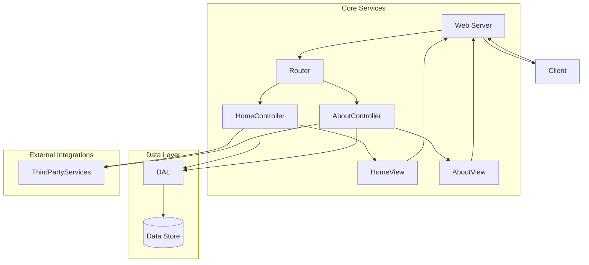

# SPARC Architecture: Basic Node.js Website

## System Components

### 1. Core Services

#### 1.1 Web Server
- **Description**: The web server component is responsible for handling incoming HTTP requests and serving the appropriate responses. It acts as the entry point for the application.
- **Technology**: Node.js with Express.js framework

#### 1.2 Router
- **Description**: The router component handles URL routing and maps incoming requests to the corresponding controllers or middleware functions.
- **Technology**: Express.js router

#### 1.3 Controllers
- **Description**: Controllers are responsible for handling the business logic of the application. They receive requests from the router, process the data, and send responses back to the client.
- **Components**:
  - `HomeController`: Handles requests for the home page.
  - `AboutController`: Handles requests for the about page.

#### 1.4 Views
- **Description**: Views are responsible for rendering the HTML content that is sent back to the client. They receive data from the controllers and generate the final HTML output.
- **Technology**: Express.js view engine (e.g., Pug, EJS, or Handlebars)

### 2. Data Layer

#### 2.1 Data Access Layer (DAL)
- **Description**: The Data Access Layer abstracts the data storage implementation details and provides a consistent interface for interacting with the data store.
- **Technology**: Node.js modules for data access (e.g., file system, database client)

### 3. External Integrations

#### 3.1 Third-Party Services
- **Description**: Depending on the requirements, the application may integrate with third-party services such as analytics, logging, or other external APIs.
- **Technology**: Node.js modules for specific service integrations

## Component Interactions

1. The web server receives an incoming HTTP request from the client (e.g., a web browser).
2. The router component analyzes the request URL and routes the request to the appropriate controller.
3. The controller processes the request, retrieves data from the Data Access Layer if needed, and prepares the response data.
4. The controller passes the response data to the corresponding view.
5. The view renders the HTML content using the provided data.
6. The web server sends the rendered HTML response back to the client.

## Data Flow

1. User input (e.g., form data, query parameters) is received by the controllers from the incoming HTTP requests.
2. The controllers may interact with the Data Access Layer to retrieve or persist data.
3. The Data Access Layer communicates with the data store (e.g., file system, database) to perform CRUD operations.
4. The controllers prepare the response data and pass it to the views.
5. The views generate the final HTML output, which is sent back to the client by the web server.

## Key Design Decisions

### Technology Choices
- **Node.js**: Chosen for its event-driven, non-blocking I/O model, making it suitable for building scalable network applications.
- **Express.js**: A popular web application framework for Node.js, providing a robust set of features for building web applications and APIs.
- **View Engine**: A templating engine (e.g., Pug, EJS, or Handlebars) for generating dynamic HTML content on the server-side.

### Architectural Patterns
- **Model-View-Controller (MVC)**: The application follows the MVC architectural pattern, separating concerns between data (models), user interface (views), and control logic (controllers).
- **Modular Design**: The application is structured into modular components, promoting code reusability, maintainability, and testability.

### Security Measures
- **Input Validation**: All user input should be validated and sanitized to prevent security vulnerabilities like Cross-Site Scripting (XSS) and SQL Injection.
- **HTTPS**: The application should be served over HTTPS to ensure secure communication between the client and server.
- **Dependency Management**: Third-party dependencies should be regularly updated to address potential security vulnerabilities.

## File and Folder Structure

```
project-root/
├── app/
│   ├── controllers/
│   │   ├── homeController.js
│   │   └── aboutController.js
│   ├── views/
│   │   ├── home.pug
│   │   └── about.pug
│   ├── models/
│   │   └── ... (optional, if using a data store)
│   ├── routes/
│   │   └── index.js
│   └── app.js
├── config/
│   └── ... (optional, for configuration files)
├── public/
│   ├── css/
│   ├── js/
│   └── images/
├── package.json
└── server.js
```

- **app/controllers/**: Contains the controller files responsible for handling the business logic of the application.
  - `homeController.js`: Handles requests for the home page.
  - `aboutController.js`: Handles requests for the about page.
- **app/views/**: Contains the view files (e.g., Pug, EJS, or Handlebars templates) for rendering HTML content.
  - `home.pug`: The template for the home page.
  - `about.pug`: The template for the about page.
- **app/models/**: (Optional) Contains the model files for interacting with the data store, if applicable.
- **app/routes/**: Contains the routing files for mapping URLs to controllers.
  - `index.js`: Defines the routes for the application.
- **app/app.js**: The entry point of the application, where the Express.js app is configured and initialized.
- **config/**: (Optional) Contains configuration files for various settings, such as database connections or environment-specific configurations.
- **public/**: Contains static assets like CSS, JavaScript, and image files.
- **package.json**: The file that defines the project's dependencies and scripts.
- **server.js**: The file that starts the Node.js server and listens for incoming requests.

## Detailed Diagrams

### Component Diagram



This component diagram illustrates the high-level architecture of the Node.js website, showing the interactions between the core services, data layer, and external integrations. The web server receives requests from clients and routes them to the appropriate controllers. The controllers interact with the data access layer (DAL) to retrieve or persist data in the data store. The controllers also communicate with external third-party services if needed. The views render the HTML content, which is sent back to the client by the web server.