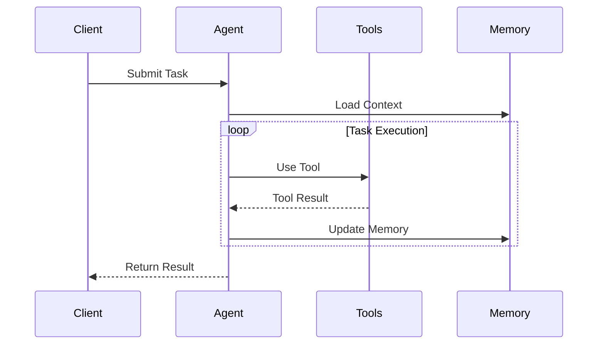

# SPARC Agent Framework

## Agent Types Matrix

| Agent Type | Purpose | Tools | Memory |
|------------|---------|-------|---------|
| Research | Information gathering | Web, Files, Memory | Long-term |
| Planning | Task breakdown | Memory, Expert | Short-term |
| Implementation | Code generation | Files, Git, Expert | Context-based |
| Math | Mathematical computation | Calculator, Symbolic | Task-specific |

## Communication Protocol



## State Management

### Memory Types
```python
class MemoryItem:
    priority: float
    timestamp: datetime
    content: str
    metadata: Dict[str, Any]

class WorkingMemory:
    short_term: List[MemoryItem]
    long_term: List[MemoryItem]
    context: Dict[str, Any]
```

## Extension Architecture

### Plugin System
```python
class AgentPlugin:
    """Base class for agent plugins"""
    def initialize(self, agent: BaseAgent) -> None:
        pass
    
    def pre_execute(self, context: Dict[str, Any]) -> None:
        pass
    
    def post_execute(self, result: Any) -> Any:
        pass
```

## Error Handling

### Pattern Implementation
```python
class AgentError(Exception):
    """Base class for agent errors"""
    def __init__(self, message: str, context: Dict[str, Any]):
        self.context = context
        super().__init__(message)

async def run_agent_with_retry(
    agent: BaseAgent,
    task: str,
    max_retries: int = 3
) -> Result:
    for attempt in range(max_retries):
        try:
            return await agent.execute(task)
        except AgentError as e:
            if attempt == max_retries - 1:
                raise
            await agent.recover(e)
```

## Implementation Examples

### Creating Custom Agent
```python
class CustomAgent(BaseAgent):
    def setup_tools(self) -> None:
        self.tools = [
            CalculatorTool(),
            MemoryTool(),
            FileSystemTool()
        ]
    
    async def execute(self, task: str) -> Result:
        plan = await self.create_plan(task)
        return await self.execute_plan(plan)
```

### Memory Integration
```python
class MemoryAwareAgent(BaseAgent):
    async def process_with_memory(
        self,
        task: str,
        context: Optional[Dict] = None
    ) -> Result:
        relevant = self.memory.search(task)
        enhanced_context = {
            **context,
            "memory": relevant
        }
        return await self.process(task, enhanced_context)
```
