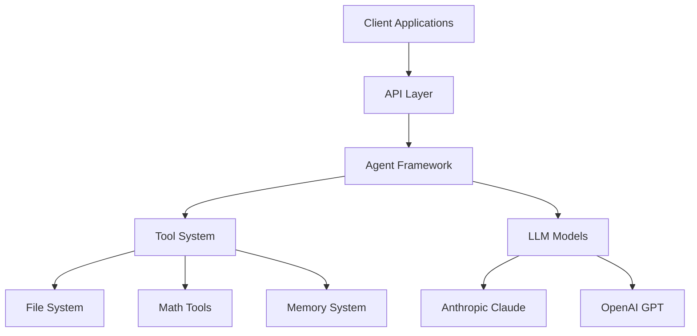
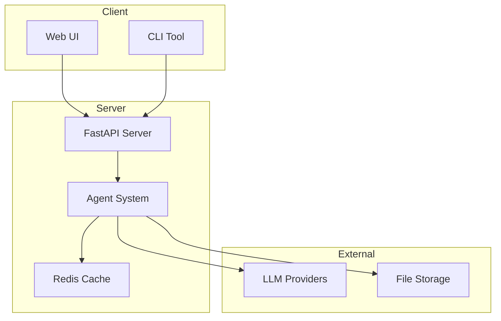

# SPARC System Architecture

## System Overview



## Component Interactions

### Core Components
- **API Layer**: RESTful endpoints for client communication
- **Agent Framework**: Orchestrates agent interactions and task execution
- **Tool System**: Pluggable architecture for extensible capabilities
- **Memory System**: Manages state and context across interactions

### Technical Stack
- **Backend**: Python 3.9+
- **API Framework**: FastAPI
- **LLM Integration**: LangChain
- **Testing**: pytest
- **Documentation**: Markdown/MkDocs

## Deployment Architecture



## Integration Points

### LLM Provider Integration
```python
async def initialize_llm(provider: str, model_name: str) -> BaseChatModel:
    if provider == "anthropic":
        return AnthropicChat(model=model_name)
    elif provider == "openai":
        return ChatOpenAI(model=model_name)
    raise ValueError(f"Unsupported provider: {provider}")
```

### Tool Integration Pattern
```python
@dataclass
class ToolConfig:
    name: str
    description: str
    parameters: Dict[str, Any]
    handler: Callable

def register_tool(config: ToolConfig) -> None:
    """Register a new tool with the agent framework"""
    validate_tool_config(config)
    TOOL_REGISTRY[config.name] = config
```

## Security Considerations
- All API endpoints require authentication
- LLM API keys stored securely in environment variables
- Input validation on all external data
- Rate limiting on API endpoints

## Performance Optimization
- Redis caching for frequent operations
- Async execution where possible
- Batch processing for large operations
